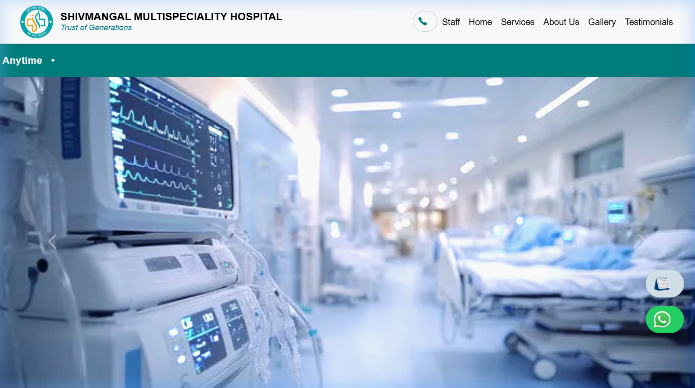

# 🏥 Shivmangal Multispeciality Hospital

> **Trust of Generations** — A modern, responsive hospital website built for Shivmangal Multispeciality Hospital & ICU, Undri, Pune.

## 🌐 Live Site

**[https://kartik0033.github.io/Shivmanagal-hospital-frontend/](https://kartik0033.github.io/Shivmanagal-hospital-frontend/)**

[](https://kartik0033.github.io/Shivmanagal-hospital-frontend/)

---

## 📋 Features

- 🚑 Hero image carousel with 24x7 emergency CTA
- 🏷️ Animated scrolling announcement ticker
- 🩺 9 medical service cards with booking buttons
- 👨‍⚕️ Doctor profiles page with detailed bio modals
- 🖼️ Photo gallery carousel
- ⭐ Patient testimonials section
- 📱 Fully responsive (mobile-friendly)
- 💬 WhatsApp & Book Appointment floating buttons

## 🛠️ Tech Stack


## 📁 Project Structure

```
Shivmanagal-hospital-frontend/
├── index.html      # Main homepage
├── doctor.html     # Doctors / Staff page
├── main.css        # Primary stylesheet
├── images/         # Service & UI assets
├── doctor/         # Doctor profile photos
└── gallery/        # Hospital gallery images
```

## 🚀 Run Locally

Just open `index.html` in any browser — no build step needed.
